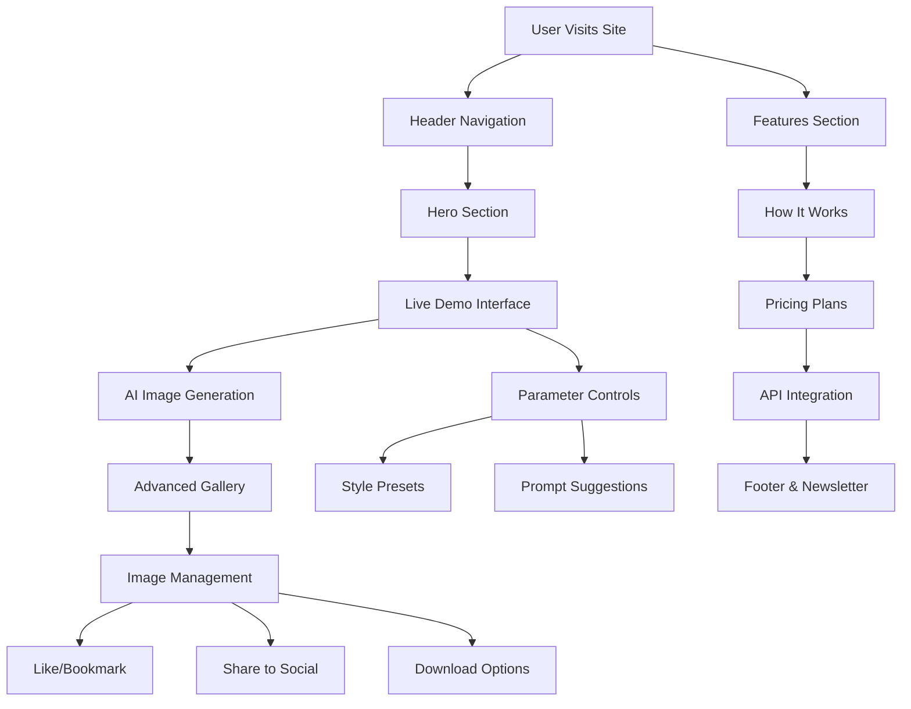
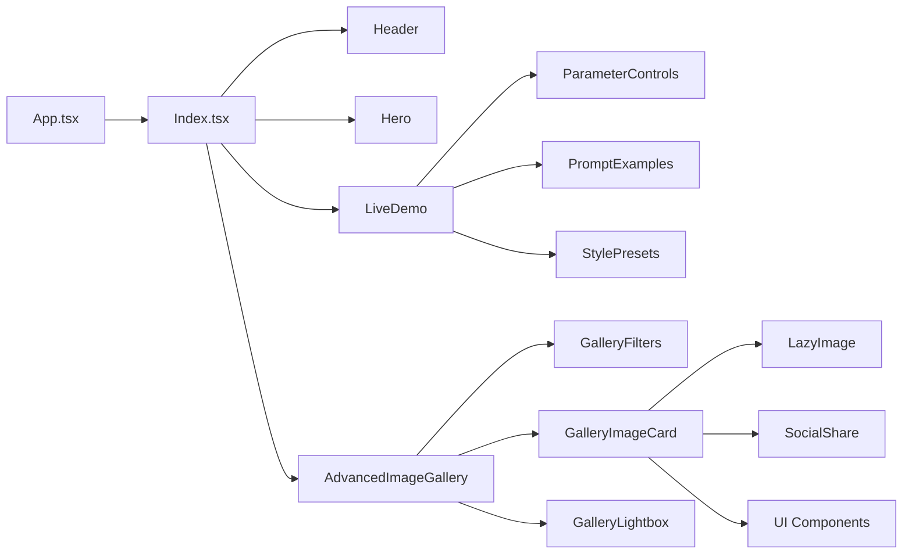
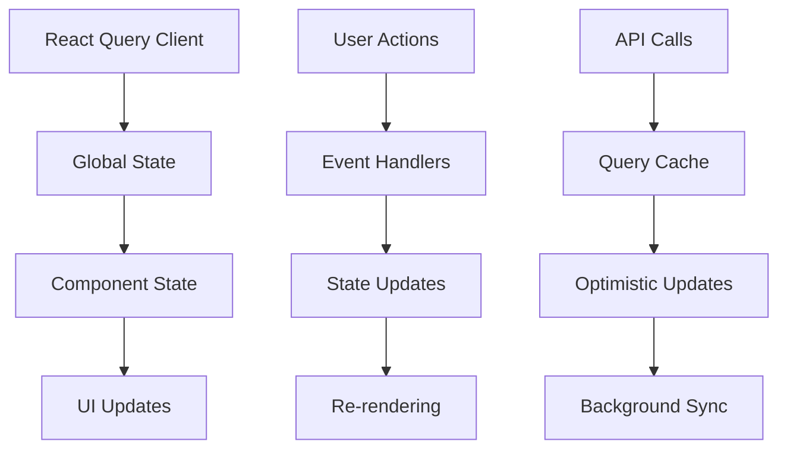
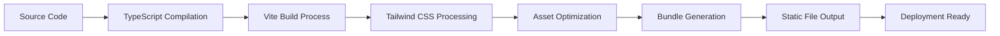

# System Architecture Documentation

## Table of Contents
- [System Overview](#system-overview)
- [Architecture Diagrams](#architecture-diagrams)
- [Component Architecture](#component-architecture)
- [Data Flow](#data-flow)
- [Integration Points](#integration-points)
- [Security Architecture](#security-architecture)

## System Overview

The AI Image Generator Platform is a modern React-based web application that provides users with an intuitive interface for generating AI-powered images. The system follows a component-based architecture with clear separation of concerns and modular design principles.

### Technology Stack
- **Frontend**: React 18, TypeScript, Vite
- **Styling**: Tailwind CSS, shadcn/ui components
- **State Management**: React Query (@tanstack/react-query)
- **Routing**: React Router DOM
- **Build Tool**: Vite with TypeScript support
- **Icons**: Lucide React
- **Notifications**: Sonner toast library

## Architecture Diagrams

### User Interaction Flow

### Component Data Flow

### State Management Flow

### Build and Deployment Flow

## Component Architecture

### Core Layout Components

#### App.tsx - Application Root
**Purpose**: Serves as the application's entry point, providing global context and routing configuration.

**Key Responsibilities**:
- Error boundary implementation for graceful error handling
- React Query client configuration for data fetching
- Toast notification provider setup
- Browser routing configuration with lazy loading
- Global theme and tooltip providers

**Architecture Pattern**: Provider pattern with HOC composition for cross-cutting concerns.

#### Index.tsx - Main Page Orchestrator
**Purpose**: Coordinates all major sections of the landing page and manages global page state.

**Key Responsibilities**:
- Section rendering and ordering
- Mobile-specific functionality (pull-to-refresh)
- Page-level state management (refresh functionality)
- Responsive layout coordination
- Background and scroll progress integration

**Architecture Pattern**: Container component pattern with conditional rendering based on device type.

### Feature Components

#### AdvancedImageGallery.tsx - Gallery System
**Purpose**: Provides a comprehensive image gallery with advanced features like masonry layout, infinite scroll, and filtering.

**Key Responsibilities**:
- Masonry grid layout implementation
- Infinite scroll with performance optimization
- Image filtering by category and style
- Search functionality integration
- Like/bookmark state management
- Modal gallery coordination

**Architecture Pattern**: Compound component pattern with state lifting and render props for flexible image display.

#### LiveDemo.tsx - Interactive Generation Interface
**Purpose**: Delivers the core AI image generation experience with real-time parameter control.

**Key Responsibilities**:
- AI model parameter management
- Prompt processing and enhancement
- Style preset application
- Generation progress tracking
- Result display and management
- Mobile optimization

**Architecture Pattern**: Controlled component pattern with hooks for complex state management.

### UI Foundation Components

#### Header.tsx - Navigation System
**Purpose**: Provides site-wide navigation with responsive design and user interaction features.

**Key Responsibilities**:
- Desktop and mobile navigation rendering
- User authentication state display
- Theme switching functionality
- Responsive menu behavior
- Brand and logo presentation

**Architecture Pattern**: Adaptive component pattern with conditional rendering based on screen size.

#### Hero.tsx - Landing Section
**Purpose**: Creates an engaging first impression with clear value proposition and call-to-action.

**Key Responsibilities**:
- Value proposition presentation
- Primary action encouragement
- Visual appeal with animations
- Responsive typography and layout
- Background integration

**Architecture Pattern**: Presentation component with minimal state and focus on visual impact.

## Data Flow

### Image Generation Flow
1. **User Input**: Prompt entry and parameter selection
2. **Validation**: Input sanitization and requirement checking
3. **API Request**: Structured request to AI generation service
4. **Progress Tracking**: Real-time generation status updates
5. **Result Processing**: Image optimization and metadata extraction
6. **Gallery Integration**: Automatic addition to user's gallery
7. **State Persistence**: Local storage for user preferences

### Gallery Management Flow
1. **Image Loading**: Lazy loading with intersection observer
2. **Filtering**: Client-side filtering with debounced search
3. **Infinite Scroll**: Progressive loading with performance optimization
4. **User Actions**: Like, bookmark, share, and download operations
5. **State Synchronization**: Optimistic updates with error recovery

## Integration Points

### External Services
- **AI Generation APIs**: Integration ready for multiple AI providers
- **Social Media APIs**: Twitter, Facebook, Instagram sharing
- **Payment Processing**: Stripe integration for subscription management
- **Analytics**: Google Analytics and custom event tracking
- **CDN Integration**: Optimized asset delivery

### Browser APIs
- **Intersection Observer**: Lazy loading and infinite scroll
- **Web Share API**: Native sharing on supported devices
- **Local Storage**: User preferences and temporary data
- **File API**: Image download functionality
- **Clipboard API**: Copy-to-clipboard features

## Security Architecture

### Client-Side Security
- **Input Sanitization**: XSS prevention for user-generated content
- **HTTPS Enforcement**: Secure communication channels
- **Content Security Policy**: Protection against injection attacks
- **API Key Management**: Secure handling of sensitive credentials

### Data Protection
- **Local Storage Encryption**: Sensitive data protection
- **CORS Configuration**: Controlled cross-origin requests
- **Rate Limiting**: Client-side request throttling
- **Error Handling**: Secure error messages without data leakage

---

*Last Updated: December 2024 | Version: 1.0.0 | Architecture Review: Quarterly*
